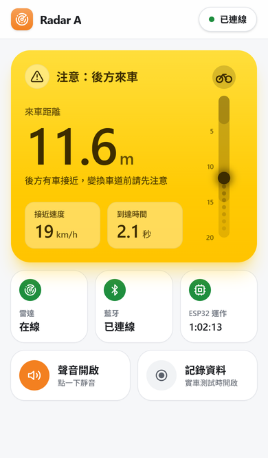
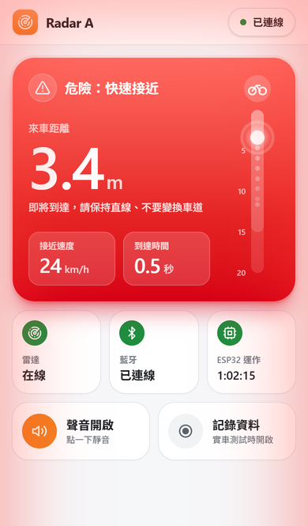
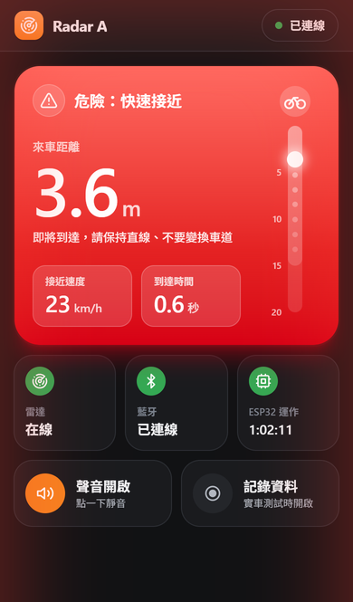
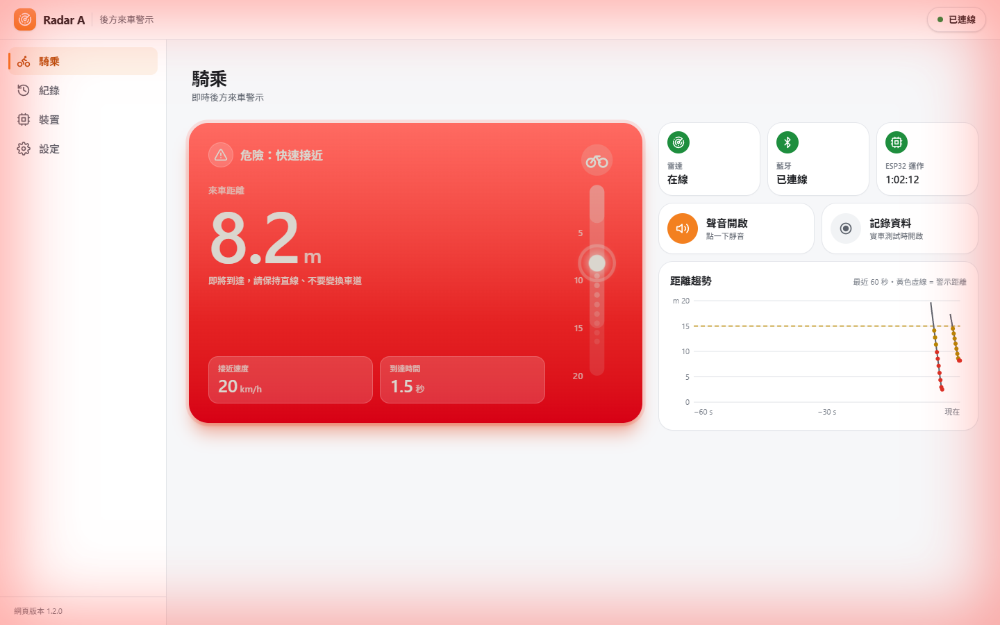
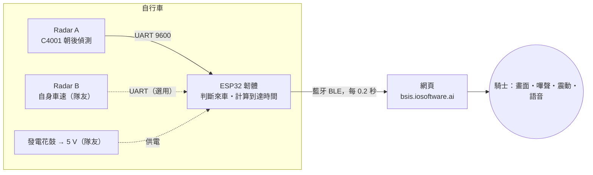

# BSIS・Radar A 後方來車偵測

> 「智慧自行車動力能源與盲區安全輔助整合系統」中的 **Radar A（後方來車偵測）** 子系統。
> 國立彰化師範大學 電機與機械科技學系 專題製作｜指導教授：陳狄成｜組員：蔡宗穎、李振源、林芯瑜

ESP32 讀取裝在座墊下方、朝後的 DFRobot C4001 24 GHz 毫米波雷達，判斷後方是否有車快速接近，再用藍牙把結果送到網頁，以**畫面顏色、嗶聲、震動、語音**提醒騎士。

<p align="center">
  
  
  
</p>
<p align="center">
  
</p>

| | 網址 |
| --- | --- |
| 網頁（手機、電腦都可以） | <https://bsis.iosoftware.ai> |
| 原始碼 | <https://github.com/Ming874/bsis-radar> |

---

## 快速開始

| 我想要… | 看這裡 |
| --- | --- |
| 第一次使用：從接線、燒錄、連線到上路，一步一步來 | **[上手文件](docs/GETTING_STARTED.md)** |
| 把韌體燒進 ESP32（不用裝 Arduino IDE） | 雙擊 [`firmware/flash.bat`](firmware/flash.bat) |
| 修改或編譯韌體 | [firmware/README.md](firmware/README.md) |
| 修改或部署網頁 | [web/README.md](web/README.md) |
| 了解 ESP32 ⇄ 網頁的資料格式、接上 Radar B | [docs/PROTOCOL.md](docs/PROTOCOL.md) |

## 系統架構



1. **雷達**（C4001，24 GHz FMCW）量測後方最強目標的距離、相對速度、反射能量（沒有角度）。
2. **ESP32 韌體**篩選「正在接近、夠大」的目標，追蹤距離與接近速度、計算到達時間，分成 安全／注意／危險 三級。
3. **網頁**透過 Web Bluetooth 接收資料並警示；不用安裝 App，Android 用 Chrome、電腦用 Chrome／Edge 開網址即可。

## 主要功能

**ESP32 韌體（`firmware/`）**

- 非阻塞雷達驅動：不使用會卡住、可能當機的 DFRobot 函式庫；斷線自動重連、設定只在開機寫入一次
- 來車判斷：接近速度 ＋ 能量門檻篩選、累積確認、距離追蹤、到達時間（TTC）分級、警示保持
- 9 項偵測參數可由網頁即時調整，存在 ESP32 的 NVS（斷電不消失）
- 藍牙依 MTU 自動分段；USB 序列埠可直接下指令
- 板上 LED 顯示狀態，不看手機也知道系統是否正常

**網頁（`web/`）**

- 騎乘畫面（iOS 小工具風格）：整張警示卡的顏色就是警示等級，圓體大字距離、直立雷達條、毛玻璃數值；危險時卡片外圈與畫面四周泛紅光
- 警示：倒車雷達式嗶聲（越近越快）、震動、中文語音
- 裝置頁：即時原始資料、室內測試／上路一鍵切換、9 項參數用滑桿調整並說明
- 紀錄：60 秒距離趨勢、實車測試 CSV、來車事件列表
- 手機版（底部分頁列）與電腦版（左側選單、雙欄、騎乘頁多一張趨勢圖）自動切換
- 預設深色主題、橘色重點色（可切淺色白底）、可加入主畫面（PWA）、所有項目都有繁中說明

## 專案結構

```text
BSIS/
├─ README.md                 本檔：專案總覽
├─ docs/
│  ├─ GETTING_STARTED.md     上手文件：接線 → 燒錄 → 連線 → 校正 → 上路
│  ├─ PROTOCOL.md            ESP32 ⇄ 網頁 的藍牙文字協定
│  └─ images/                畫面截圖
├─ firmware/                 ESP32 韌體
│  ├─ RadarA_C4001_BLE/      Arduino 專案（分層：drivers / core / comm / storage / app）
│  ├─ release/               預先編譯好的韌體（給 flash.bat 燒錄）
│  ├─ tests/                 電腦端單元測試
│  ├─ legacy/                舊版 v1（只供對照）
│  ├─ flash.bat / flash.ps1  一鍵燒錄（不需 Arduino IDE）
│  └─ arduino.ps1            開發用指令：編譯、燒錄、監看、測試、輸出 release
└─ web/                      網頁（React + TypeScript + Vite + Tailwind）
   └─ src/                   domain / infrastructure / application / ui（含設計系統 ui/kit）
```

> 專題計畫書 PDF 含個人資料，沒有放進公開 repo。

## 硬體

| 元件 | 說明 |
| --- | --- |
| ESP32 DevKit（ESP32-WROOM，USB 晶片 CH340） | 主控與藍牙 |
| ESP32 擴充底板 | 供電與排針；**它的 USB 孔只供電、不能燒錄** |
| DFRobot C4001 mmWave 25 m（SEN0609） | 24 GHz FMCW，測距 25 m、測速 0.1～10 m/s、波束 100°×40°，UART 9600 |
| 行動電源（測試）／發電花鼓＋穩壓（成品） | 5 V 供電，整套約 0.15～0.25 A（估計） |
| Android 手機（Chrome）或電腦（Chrome／Edge） | 顯示與警示 |

| C4001 腳位 | 接到 |
| --- | --- |
| VIN | 擴充底板 V（5 V） |
| GND | 擴充底板 G |
| TX | GPIO16（ESP32 RX2） |
| RX | GPIO17（ESP32 TX2） |
| OUT | 不接 |

## 開發與測試

```powershell
# 韌體（在 firmware 資料夾）
.\arduino.ps1 test       # 電腦端單元測試
.\arduino.ps1 compile    # 編譯（ESP32 Dev Module）
.\arduino.ps1 upload     # 燒錄（自動找 COM 埠）
.\arduino.ps1 release    # 更新 release\，給 flash.bat 用
```

```bash
# 網頁（在 web 資料夾）
npm install
npm run dev     # 開發伺服器
npm test        # 單元測試
npm run lint
npm run build
```

## 部署

網頁部署在 Zeabur（專案 `bsis-radar`），網域 <https://bsis.iosoftware.ai>。Zeabur 連結這個 GitHub repo 的 `main` 分支，**push 之後會自動重新建置 `web/` 並上線**，不需要手動部署。

## 實機測試結果（2026-10-03）

| 項目 | 結果 |
| --- | --- |
| 燒錄與開機 | 成功；雷達約 4.8 秒完成設定並開始輸出 |
| USB／藍牙指令、設定保存 | 正常；重開機後設定仍保留 |
| 人走近 25 秒（4 次） | 接近時 41 筆中 34 筆警示（其餘為確認前 0.3～0.5 秒）；後退只在保持時間內警示 |
| 距離追蹤 | 與雷達原始距離相差 0.03～0.07 m |
| 正式網頁 ↔ 實機 | Chrome 連線、讀取設定、記錄到真實來車事件 |

尚未做上路實測；請依[上手文件](docs/GETTING_STARTED.md)的步驟校正後再測。

## 已知限制

- C4001 只回報最強的一個目標、**沒有角度**：分不出來車在哪個車道。
- 測速上限 10 m/s（36 km/h 相對速度），更快的來車可能量錯速度。
- 網頁必須在前景（螢幕常亮）；iPhone Safari 不支援 Web Bluetooth（改用 Bluefy），Brave 需手動開啟。
- 藍牙未加密：校正完成、正式上路前請把 `AppConfig.h` 的 `kAllowBleConfig` 改成 `false`。
