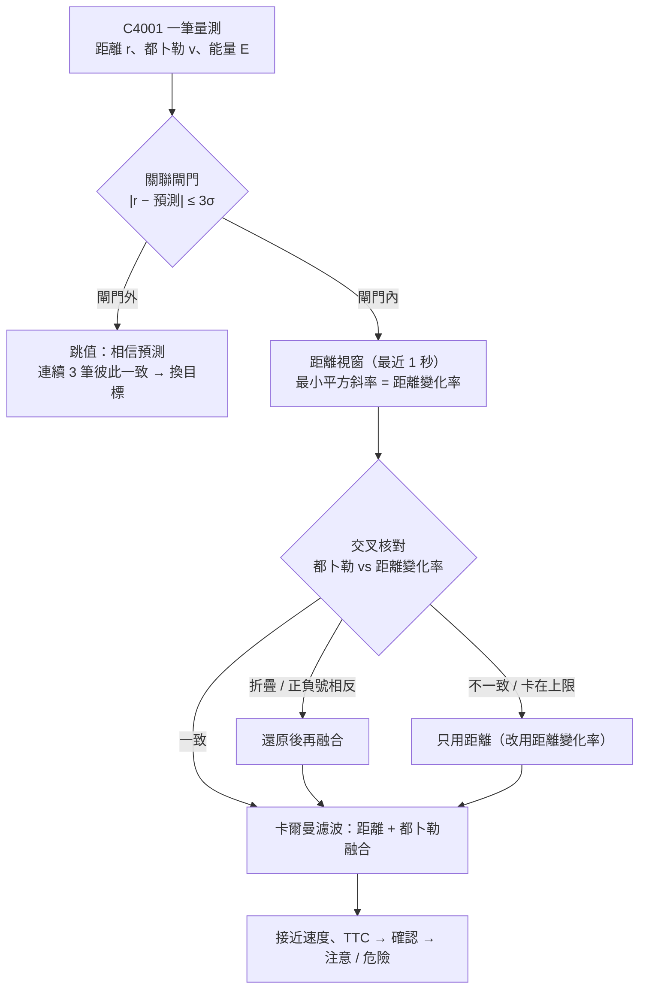

# 來車速度演算法：都卜勒 × 距離變化率交叉核對（韌體 v2.1.0）

> 對象：專題組員、指導老師，以及之後要調整演算法的人。
> 程式碼：`firmware/RadarA_C4001_BLE/src/core/`（`ThreatTracker`、`RangeKalman`、`RangeRateWindow`、`VelocityCheck`），單元測試在 `firmware/tests/host_tests.cpp`。

## 1. 為什麼要改

C4001 每一筆只回報**最強的一個目標**的距離、徑向速度（都卜勒）與反射能量，沒有角度。兩個量的特性剛好互補：

| | 都卜勒速度 | 距離變化率（距離對時間的斜率） |
| --- | --- | --- |
| 精度 | 高（約 0.1 m/s 等級） | 低：C4001 距離未校正、24 GHz 頻寬限制解析度約 0.6 m [1][3]，兩筆相減雜訊可達數 m/s |
| 量測範圍 | **有上限**：規格 ±10 m/s [1][2]，超過時可能折疊（例如 −13 m/s 報成 +7 m/s）或卡在上限 [3] | 沒有上限、不會折疊 |
| 正負號 | 依雷達定義，設定錯就整個反過來 | 由距離增減直接決定 |

舊版（v2.0.0）只相信都卜勒，所以下列情況會**完全漏掉來車**或速度錯很多：相對速度超過 36 km/h（折疊後看起來在遠離）、雷達偶爾報 0 速度、`SIGN` 設反。對單一點目標而言，都卜勒速度與距離變化率**是同一個物理量**；兩者不一致代表量測出了問題（折疊、飽和、換了目標、鬼影），而不是物理現象——這就是交叉核對的依據 [8][9]。

## 2. 架構



## 3. 卡爾曼濾波器（`RangeKalman`）

狀態 **x = [r, ṙ]ᵀ**（距離、距離變化率；ṙ < 0 = 接近）。等速模型 + 離散白雜訊加速度（DWNA）[5][6]：

```text
x⁻ = F x，F = [1 Δt; 0 1]
P⁻ = F P Fᵀ + Q，Q = σa² [Δt⁴/4  Δt³/2; Δt³/2  Δt²]
```

量測有兩種，雜訊互相獨立（R 為對角），所以**依序做純量更新**，結果與一次矩陣更新相同 [5]：

```text
距離：  H = [1 0]，S = P₀₀ + σr²，K = P Hᵀ / S，x ← x + K(r − x₀)，P ← (I − K H) P
都卜勒：H = [0 1]，S = P₁₁ + σv²（只有通過交叉核對的那一筆才更新）
```

新追蹤的速度先給較大的不確定度（σ = 6 m/s），都卜勒核對通過前不放進濾波器，避免被折疊的速度帶偏。只用距離更新時，穩態等同 α-β 濾波器，增益可用 Kalata 的追蹤指數估算 [7]。

## 4. 距離變化率（`RangeRateWindow`）

用最近 1 秒內通過關聯閘門的距離做最小平方直線擬合（等同 Savitzky–Golay 一階導數 [12]）：

```text
ṙ_LS = Σ(tᵢ − t̄)(rᵢ − r̄) / Σ(tᵢ − t̄)²
σ(ṙ_LS) = σ / √Σ(tᵢ − t̄)²，等間隔 T、N 筆時 = σ·√12 / (T·√(N(N² − 1)))
```

- σ 用感測器距離雜訊 σr；至少 5 筆時，若殘差變異數更大（例如車身反射點飄移）就改用殘差，筆數太少時不拿殘差放大或縮小。
- 10 Hz、σr = 0.2 m 時：3 筆 σ ≈ 1.4 m/s、6 筆 ≈ 0.5 m/s、10 筆 ≈ 0.2 m/s——足以分辨「差 20 m/s 的折疊」，但不夠取代都卜勒的精度。所以**都卜勒負責精度，距離變化率負責當裁判**。
- 加減速時斜率代表「視窗中點」的速度。長期核對時拿它和**同一視窗內採用的都卜勒平均**比較（也代表中點），兩者的落後互相抵消 [研究整理]。

## 5. 交叉核對（`VelocityCheck`）

每一筆依下列順序判斷：

1. **量測上限**：|v| ≥ 9.8 m/s（接近 10 m/s 的上限或折疊邊界）不採用；連續卡住代表飽和，改用距離變化率。
2. **參考速度**：都卜勒已確認可信 → 用卡爾曼預測（精確）；否則 → 短窗（≥ 3 筆）距離斜率，變異數再加上落後誤差 (σa·t̄)²。
3. **假設檢定**：預設解釋（依 `SIGN`、不折疊）、折疊 ±20 m/s、正負號相反（以及「相反後再折疊」，只在正負號相反已確定後才考慮）。閘門：

   ```text
   |假設 − 參考| ≤ 3·√(σ參考² + σv²) + 0.3 m/s
   ```

   預設解釋落在閘門內就用它；否則取其他解釋中誤差最小的。都卜勒尚未確認時若有兩個以上其他解釋都說得通，**不猜**，等距離資料多一點再判斷。這與 TI mmWave 追蹤器（gtrack）以預測徑向速度「展開」都卜勒的作法相同 [4]，也類似 GM 以多個假設追蹤解決都卜勒模糊的專利 [10]。
4. **正負號鎖定**：只有唯一解釋符合時才鎖定這個目標的正負號（目標不會中途改變正負號），之後只在同一組裡考慮折疊——避免在 10 m/s 邊界把「折疊」誤判成「正負號相反」。
5. **長期核對**：長窗（≥ 6 筆、≥ 0.45 s）內，|ṙ_LS − 都卜勒平均| ≤ 3·√(σ_LS² + σv²/n) + 0.3。
6. **遲滯**：連續 2 次不一致 → 改用距離變化率（若是因為不一致，濾波器直接改成最小平方擬合的距離與速度與其共變異數）；連續 3 次一致 → 恢復使用都卜勒。

結果以 `VS` 欄位送到網頁（裝置頁「速度核對」）：核對中、一致、已還原折疊、改用距離、正負號相反。

## 6. 關聯與換目標

- 驗證閘門：|r − r̂⁻| ≤ 3·√(P₀₀ + σr²)，夾在 1.2～3.0 m（車身長，最強反射點會前後跳）。都卜勒尚未確認時，用物理上限 25 m/s 估閘門，避免折疊的速度造成誤判跳值。
- 閘門外的跳值先相信預測；**連續 3 筆、彼此一致**（像同一個新物體）才換目標重新追蹤 [研究整理]。車身反射點亂跳產生的跳值彼此不一致，不會讓追蹤換到雜訊上。

## 7. 確認、分級、TTC

接近速度 = −ṙ̂（核對完成前暫時直接用都卜勒，反應最快）。接近速度 ≥ `MINSPD`、能量 ≥ `MINE` 的資料累積到 `CONFIRM` 分才確認（漏一筆只扣一分）。TTC = r̂ / 接近速度；距離 ≤ `RANGE` 為注意，TTC ≤ `DTTC` 或距離 ≤ `DDIST` 為危險；目標消失後警示保持 `HOLD`。ISO 17387 的 TTC 定義相同（距離 ÷ 接近速度）[13]。

## 8. 參數

| 參數 | 值 | 依據 |
| --- | --- | --- |
| σr 距離雜訊 | 0.2 m | 模擬中在實際雜訊 0.2～0.3 m 時整體表現最好；≥ 5 筆時殘差較大會自動放寬 |
| σv 都卜勒雜訊 | 0.2 m/s | C4001 最小速度規格 0.1 m/s [2]，保守放大 |
| σa 相對加速度 | 3 m/s² | 煞車、加速；Labbe 建議取最大加速度變化的 ½～1 倍 [6] |
| 驗證閘門 | 3σ + 0.3 m/s | 常態分布約 99.7%（χ²₁ = 9）[11] |
| 短窗 / 長窗 | 0.6 s ≥ 3 筆 / 1 s ≥ 6 筆 | §4 的 σ 與反應速度取捨 |
| 折疊週期 | 20 m/s | 規格 ±10 m/s [1][2]（實際行為待實測） |
| 換目標 | 連續 3 筆一致的跳值 | |

## 9. 驗證

**單元測試**（`.\arduino.ps1 test`，173 項）：最小平方斜率與標準差公式、卡爾曼收斂，以及下列每種情境的偵測與誤差門檻。

**舊版 vs 新版模擬比較**：每種情境 50 次，距離雜訊 σ 0.2 m、都卜勒雜訊 σ 0.15 m/s、10 Hz；誤差從確認追蹤 0.5 秒後開始算。

| 情境 | 偵測率 舊 → 新 | 接近速度 RMS 誤差（m/s） | 距離 RMS 誤差（m） | TTC RMS 誤差（s） |
| --- | --- | --- | --- | --- |
| 一般汽車 7 m/s | 100% → 100% | 0.09 → 0.12 | 0.12 → **0.07** | 0.02 → 0.03 |
| 快車 13 m/s，都卜勒**折疊** | **0%** → **100%** | — → 0.12 | — → 0.07 | — → 0.01 |
| 快車 13 m/s，都卜勒**飽和**在 10 | 100% → 100% | 3.00 → **0.26** | 0.32 → 0.12 | 0.17 → 0.02 |
| 加速 8 → 12 m/s（越過 10） | 100% → 100% | 15.88 → **0.29** | 4.91 → **0.08** | 0.11 → 0.03 |
| 都卜勒一直報 0（6 m/s） | **0%** → **100%** | — → 0.28 | — → 0.12 | — → 0.08 |
| `SIGN` 設反（7 m/s） | **0%** → **100%** | — → 0.12 | — → 0.07 | — → 0.02 |
| 車身反射跳動 ±2.5 m（10%） | 100% → 100% | 0.09 → 0.12 | 0.40 → **0.11** | 0.06 → 0.03 |
| 煞車 8 → 2 m/s | 100% → 100% | 0.40 → **0.17** | 0.12 → 0.07 | 1.43 → 0.81 |

- 一般情況下新版的速度略雜（0.12 vs 0.09 m/s）：濾波器為了跟上煞車與加速而保留較高頻寬；距離更準、TTC 相同。
- 實際雜訊放大到 σ 0.3 m 時，新版各情境偵測率仍為 100%。
- 煞車時 TTC 誤差來自「等速 TTC」本身的定義（減速中的車實際到達得比較晚），兩版都有。

## 10. 尚待實車驗證

- **C4001 超過 10 m/s 的實際行為**（折疊、飽和或直接不回報）沒有官方文件 [1]。演算法三種都能處理，但請用已知速度（12～20 m/s 相對速度）的實車通過測試確認：開啟「記錄資料」後看 CSV 的 `raw_speed_mps`、`velocity_source`、`range_rate_mps`。
- C4001 距離與速度的實際雜訊、更新率（文件未載明 [1]）：可從等速接近的紀錄估計，再調整 σr、σv。
- 實機觀察：在室內 2.5 m 內、人走動時，曾看到都卜勒約 0.2 m/s 而距離變化約 2～3 m/s，韌體改用距離變化率；近距離人體反射點會跳動，這類情況以實車資料為準再調整。
- 方位：C4001 沒有角度輸出，無法分辨左右車道（見 README 已知限制）。

## 參考文獻

1. DFRobot, *C4001 mmWave Sensor (25 m) Datasheet / Communication Protocol V1*. https://dfimg.dfrobot.com/wiki/20522/SEN0609_gravity-c4001-24ghz-mmwave-human-presence-detection-sensor_datasheet_V1.pdf
2. DFRobot, SEN0609 產品頁. https://www.dfrobot.com/product-2793.html
3. C. Iovescu, S. Rao, "The fundamentals of millimeter wave radar sensors," Texas Instruments SPYY005A, 2020. https://www.ti.com/lit/pdf/spyy005
4. Texas Instruments, mmWave SDK `gtrack` group tracker（`gtrack_unrollRadialVelocity` 等）. 設定說明：https://ti.com/document-viewer/lit/html/TIDUE71D/configuration-parameters-t5323204-19.html
5. Y. Bar-Shalom, X. R. Li, T. Kirubarajan, *Estimation with Applications to Tracking and Navigation*, Wiley, 2001（第 5、6 章）. doi:10.1002/0471221279
6. R. Labbe, *Kalman and Bayesian Filters in Python*, ch. 7. https://github.com/rlabbe/Kalman-and-Bayesian-Filters-in-Python
7. P. R. Kalata, "The tracking index: a generalized parameter for α-β and α-β-γ target trackers," IEEE TAES 20(2):174–182, 1984. doi:10.1109/TAES.1984.310438
8. Westinghouse, US 4,816,833 A, "Pulse Doppler surveillance post signal processing and scan to scan correlation," 1989. https://patents.google.com/patent/US4816833A/en
9. Intel, US 12,000,957 B2, "Range Doppler consistency check for radar ghost target detection," 2024. https://patents.google.com/patent/US12000957B2/en
10. GM, US 11,119,187 B2, "Resolution of Doppler ambiguity in a radar system through tracking," 2021. https://patents.google.com/patent/US11119187B2/en
11. U. Orguner, "Target Tracking: Lecture 3 – Single target tracking issues," METU EE793（驗證閘門與 χ² 門檻）. https://users.metu.edu.tr/home405/umut/wwwhome/ee793/files/METULecture3.pdf
12. A. Savitzky, M. J. E. Golay, "Smoothing and differentiation of data by simplified least squares procedures," Anal. Chem. 36(8):1627–1639, 1964. doi:10.1021/ac60214a047
13. ISO 17387:2008, *Lane change decision aid systems*（TTC 定義、接近速度分級）. https://cdn.standards.iteh.ai/samples/43654/701fd49bde7b4d3db165444b7c6f0c53/ISO-17387-2008.pdf

[研究整理]：依上述文獻推導的作法（例如以視窗中點比較消除落後、換目標的一致性判斷），在本專題的模擬中驗證。
